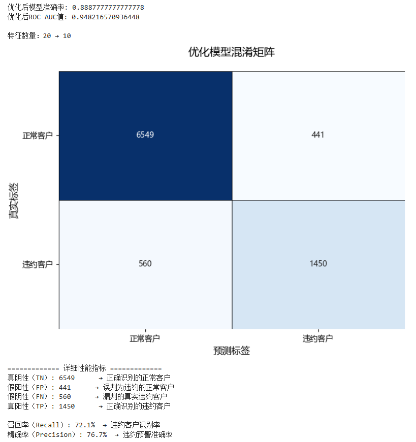
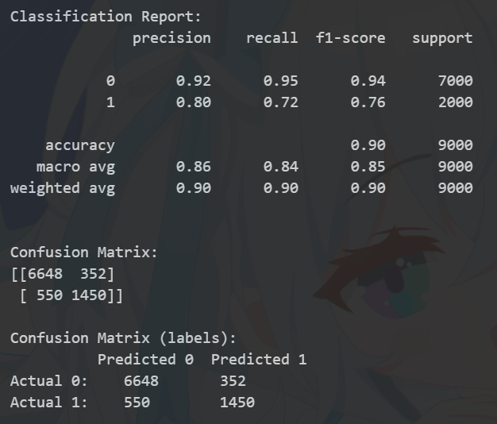
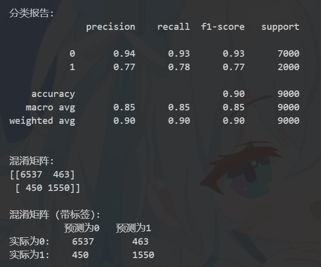
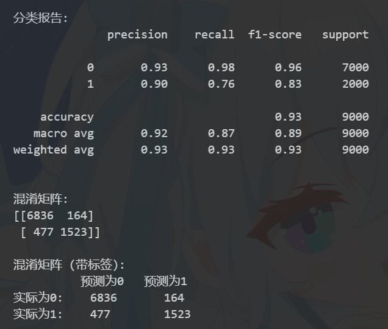
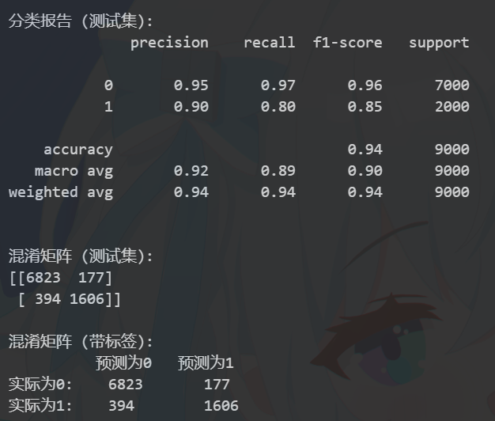
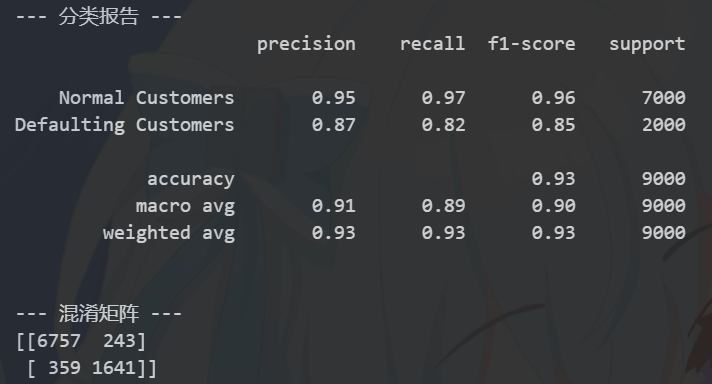
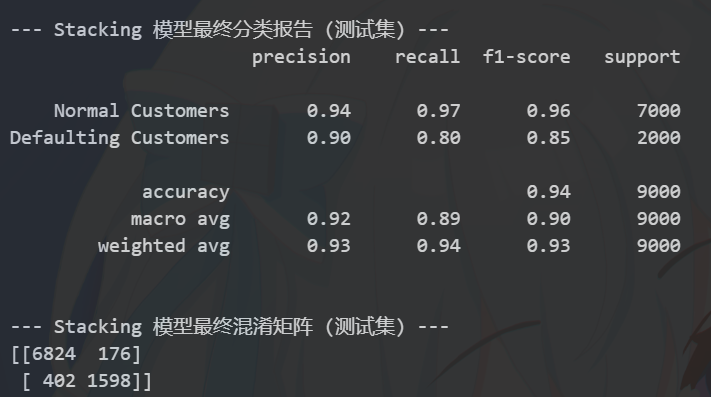
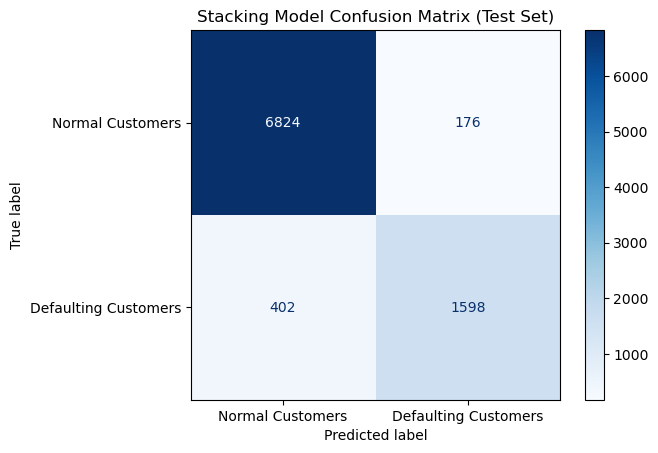

# Stacking 实验报告

## 实验思路

普通的Logistic Regression上限准确率只有0.88，且召回率和精确率都难以达到业务应用水平，为了提高模型准确率、召回率、精确率等指标，更精准地识别违约客户和进行违约预警，特尝试了其他多种模型，包括KNN、决策树、随机森林、CatBoost、BERT等，并选择其中三个效果较好且具有较大结构性差异的模型进行Stacked Generalization，以期进一步提高预测效果。

## 各单一模型预测结果

### KNN

**总体评价:**

该 KNN 模型在区分客户是否会违约方面展现了一定的能力（整体准确率 90%），但从银行业务风险控制和盈利性的角度来看，存在明显的改进空间，尤其是在识别潜在违约风险方面。

**关键指标分析及其业务含义：**

1. **违约客户识别能力 (Recall for Class 1 'Defaulting Customers': 0.72)**

   * **业务含义:** 这是模型最关键的短板之一。它意味着在所有**实际会发生违约**的客户中，该模型**只能成功识别出其中的 72%**。
   * **风险点:** 剩下的 **28% 的实际违约客户 (对应混淆矩阵中的 550 个 False Negatives)** 被模型错误地预测为“不会违约”。在实际业务中，银行很可能会基于这个模型的预测结果批准这些客户的贷款。这 550 笔贷款最终会变成坏账，直接导致银行的**信贷损失**，侵蚀利润，并可能增加拨备覆盖压力。这是银行风险管理部门最关心的问题。
2. **预测违约的准确性 (Precision for Class 1 'Defaulting Customers': 0.80)**

   * **业务含义:** 当模型预测一个客户**会违约**时，这个预测有 80% 的可能性是正确的。
   * **业务影响:** 另外 20% 的情况 (对应混淆矩阵中的 352 个 False Positives) 是模型错误地将**本不会违约**的客户标记为“会违约”。这会导致：
     * **错失良机:** 银行可能会拒绝这些客户的贷款申请，从而损失了本可以安全获得的利息收入和潜在的长期客户关系。
     * **客户体验下降:** 被错误拒绝或被要求更严格条件（如更高利率、更多抵押物）的客户可能会感到不满，影响银行声誉。
3. **正常客户识别能力 (Recall for Class 0 'Normal Customers': 0.95 & Precision: 0.92)**

   * **业务含义:** 模型在识别**不会违约**的客户方面表现较好。它正确识别了 95% 的正常客户，并且当它预测客户正常时，有 92% 的准确率。
   * **业务影响:** 这意味着模型能有效地通过大部分合格的贷款申请，保障了正常的业务流程和收入来源。然而，如前所述，那 8% 的错误预测（预测为正常，实际违约）就是直接的信贷损失（即 False Negatives）。
4. **混淆矩阵的直接解读:**

   * **TN (6648):** 优质业务 - 正确批准了大量不会违约的客户。
   * **TP (1450):** 风险规避 - 成功识别了大部分会违约的客户，银行可以据此采取措施（拒绝、提高条件等）。
   * **FP (352):** 业务损失 - 错拒或提高了 352 个本可带来收益的客户的门槛。
   * **FN (550):** **核心风险暴露** - 批准了 550 个最终会违约的贷款，这是最需要关注和减少的数字。

**业务决策启示:**

1. **风险容忍度评估:** 银行需要评估，错过 28% 的实际违约者（550 个 FN）是否在其风险容忍范围之内。对于大多数银行而言，这可能是一个偏高的比例，意味着潜在的坏账损失较大。
2. **模型优化方向:** 重点应放在**提高对违约客户的召回率 (Recall for Class 1)** 上。银行可能愿意接受 Precision for Class 1 的轻微下降（即增加一些 FP），来换取 Recall 的显著提升（减少 FN）。这可以通过调整模型参数、尝试对召回率更敏感的模型（如调整后的逻辑回归、某些 Boosting 算法配置）或调整分类阈值来实现。
3. **成本效益分析:** 需要量化 False Negative（坏账损失）和 False Positive（错失利息收入）的成本。通常 FN 的成本远高于 FP。模型评估和阈值选择应基于这种不对称成本进行优化，目标是最小化总体预期损失。
4. **人工干预:** 对于模型预测为“正常”但置信度不高的客户（如果模型能输出概率），或者处于决策边界附近的客户，可以引入信贷审批人员进行二次审核，作为一道额外的风险防线。
5. **模型比较:** 需要将 KNN 的结果与其他模型（如之前的随机森林、CatBoost、BERT 或银行现有的评分卡模型）进行对比。如果其他模型在关键指标（尤其是 Recall for Class 1）上表现更好，应优先考虑使用或融合那些模型。

**总结:**

虽然 KNN 模型提供了一些基础的区分能力，但其在识别实际违约风险方面的不足（较低的 Recall for Class 1 和大量的 False Negatives）使其在银行实际应用中存在显著风险。银行在使用此模型时需要非常谨慎，并应优先考虑优化模型以减少 False Negatives，或者选择/融合在风险识别方面表现更优异的模型。

### 决策树

**决策树模型结果分析 (独立分析):**

1. **总体表现:** 决策树模型的整体准确率也是 90%，与 KNN 持平。这表明它在区分好坏客户方面具有相似的总体判别能力。
2. **违约客户识别能力 (Recall for Class 1 'Defaulting Customers': 0.78)**

   * **业务含义:** 这是决策树模型相对于 KNN 的一个**显著改进**。模型能够识别出 **78%** 的实际违约客户，高于 KNN 的 72%。
   * **风险点:** 对应的 False Negatives (FN) 数量为 **450** (实际违约但预测为正常)。虽然仍有 22% 的实际违约客户被遗漏，但这个数字**低于 KNN 的 550**。这意味着直接因模型误判而批准的坏账贷款数量减少了 100 笔。从风险控制角度看，这是一个重要的进步，**减少了银行的直接信贷损失敞口**。
3. **预测违约的准确性 (Precision for Class 1 'Defaulting Customers': 0.77)**

   * **业务含义:** 当决策树模型预测客户会违约时，其准确率为 77%，略低于 KNN 的 80%。
   * **业务影响:** 这意味着 False Positives (FP) 的数量有所增加，达到了 **463** (预测违约但实际正常)，高于 KNN 的 352。这表明决策树模型更倾向于将一些本不会违约的客户也标记为风险客户。
     * **错失机会增加:** 银行可能会因此拒绝更多本可以安全发放贷款并带来收益的客户。
     * **潜在客户体验影响:** 更多客户可能被不必要地拒绝或施加更严格的条件。
4. **正常客户识别能力 (Recall for Class 0: 0.93 & Precision: 0.94)**

   * **业务含义:** 模型识别正常客户的召回率 (93%) 略低于 KNN (95%)，这与 FP 的增加相对应。但其预测正常客户的精确率 (94%) 略高于 KNN (92%)，这与 FN 的减少相对应。
5. **混淆矩阵解读:**

   * **TN (6537):** 正确识别的正常客户数量略少于 KNN。
   * **TP (1550):** 正确识别的违约客户数量多于 KNN (1450)。**(优于 KNN)**
   * **FP (463):** 错误标记为违约的正常客户数量多于 KNN (352)。**(劣于 KNN)**
   * **FN (450):** 错误标记为正常的违约客户数量少于 KNN (550)。**(优于 KNN)**

**决策树 vs. KNN 对比分析与业务决策:**

1. **核心差异：风险与机会的权衡**

   * **决策树:** 更擅长**识别风险 (更高的 Recall for Class 1, 更低的 FN)**，但代价是可能**更保守，错失更多机会 (更低的 Precision for Class 1, 更高的 FP)**。
   * **KNN:** 在识别风险方面表现较差 (更低的 Recall for Class 1, 更高的 FN)，但相对不那么保守，**错失的机会较少 (更高的 Precision for Class 1, 更低的 FP)**。
2. **银行视角下的选择：**

   * **风险控制优先:** 对于绝大多数银行来说，控制信贷风险、减少坏账损失是首要任务。False Negative (FN) 带来的实际资金损失通常远大于 False Positive (FP) 带来的机会成本损失。因此，决策树模型**减少了 100 个 FN**，这在业务上通常被认为是一个**重大的优势**。银行更倾向于选择能更有效识别出潜在坏账的模型。
   * **业务增长导向:** 如果银行处于激进扩张阶段，对风险容忍度较高，且有很强的催收能力，可能会对 KNN 略高的 Precision for Class 1 和更低的 FP 更感兴趣。但这通常不是主流策略，因为高 FN 带来的损失难以弥补。
3. **模型局限性:** 尽管决策树在关键的风险指标上优于 KNN，但 78% 的违约客户召回率仍然意味着有超过五分之一的坏账会被漏掉，且错失了 463 个潜在的好客户。这表明单一的决策树模型（尤其是在未进行剪枝或集成优化的情况下）可能也不是最优选择。

**总结:**

从银行贷款业务角度看，**决策树模型通常优于 KNN 模型**，因为它在识别实际违约客户方面表现更好（更高的 Recall Class 1），从而能更有效地帮助银行**规避信贷风险，减少实际的坏账损失 (FN 更低)**。虽然这会带来拒绝更多潜在好客户（FP 更高）的代价，但在风险厌恶的银行业环境中，减少直接损失通常比最大化潜在机会更为重要。

然而，两个模型都还有改进空间。这进一步说明了为什么后续尝试随机森林、CatBoost 以及堆叠模型等更复杂的集成方法是有价值的，它们的目标通常是在保持或提高风险识别能力（高 Recall Class 1）的同时，尽量减少对好客户的误判（提高 Precision Class 1）。

### 随机森林

**随机森林模型结果分析 (独立分析):**

1. **总体表现:** 随机森林模型的整体准确率达到了 93%，高于 KNN 和决策树的 90%。这表明它在整体上区分好坏客户的能力更强。
2. **违约客户识别能力 (Recall for Class 1 'Defaulting Customers': 0.76)**

   * **业务含义:** 模型能够识别出 **76%** 的实际违约客户。这个比例**优于 KNN (72%)**，但略**低于决策树 (78%)**。
   * **风险点:** 对应的 False Negatives (FN) 数量为 **477** (实际违约但预测为正常)。这意味着仍有 24% 的实际违约客户会被错误批准。虽然这个数字低于 KNN 的 550，但比决策树的 450 要多。银行的直接信贷损失风险介于 KNN 和决策树之间。
3. **预测违约的准确性 (Precision for Class 1 'Defaulting Customers': 0.90)**

   * **业务含义:** 这是随机森林模型的一个**非常显著的优势**。当模型预测客户会违约时，其准确率高达 90%，远高于 KNN (80%) 和决策树 (77%)。
   * **业务影响:** 这意味着 False Positives (FP) 的数量大幅减少，仅为 **164** (预测违约但实际正常)，远低于 KNN (352) 和决策树 (463)。
     * **机会损失最小化:** 银行因模型误判而拒绝的优质客户数量显著减少，最大程度地保留了潜在的利息收入和客户资源。
     * **客户体验提升:** 更少的客户会遭遇不必要的拒绝或更严格的贷款条件。
4. **正常客户识别能力 (Recall for Class 0: 0.98 & Precision: 0.93)**

   * **业务含义:** 模型在识别正常客户方面表现极佳 (Recall 98%)，并且预测结果的可信度也很高 (Precision 93%)。这保证了大部分合格客户能够顺利通过审批。
5. **混淆矩阵解读:**

   * **TN (6836):** 正确识别的正常客户数量最多。**(优于 KNN & DT)**
   * **TP (1523):** 正确识别的违约客户数量介于 KNN(1450) 和 DT(1550) 之间。
   * **FP (164):** 错误标记为违约的正常客户数量最少。**(显著优于 KNN & DT)**
   * **FN (477):** 错误标记为正常的违约客户数量介于 KNN(550) 和 DT(450) 之间。

**随机森林 vs. KNN & 决策树 对比分析与业务决策:**

1. **核心权衡：风险控制 vs. 业务机会**

   * **随机森林:** 在**风险控制 (FN=477)** 方面优于 KNN (FN=550) 但略逊于决策树 (FN=450)。然而，在**抓住业务机会、避免误伤优质客户 (FP=164)** 方面，它**显著优于** KNN (FP=352) 和决策树 (FP=463)。
   * **决策树:** 风险控制最好 (FN 最低)，但机会成本最高 (FP 最高)。
   * **KNN:** 风险控制最差 (FN 最高)，机会成本介于两者之间 (FP 居中)。
2. **银行视角下的选择：**

   * **平衡性最佳:** 随机森林提供了一个非常好的平衡点。它显著降低了 FN（相比 KNN），同时将 FP 控制在非常低的水平。
   * **决策权衡:** 银行需要考虑：是否愿意接受比决策树多出的 27 个坏账 (477 - 450)，来换取避免错误拒绝近 300 个 (463 - 164) 优质客户的机会？
   * **可能的偏好:** 对于大多数追求稳健增长的银行而言，**随机森林可能是这三个模型中最具吸引力的选择**。虽然它在识别每一个潜在风险上略逊于决策树，但它极大地减少了对优质客户的误判，这对维持业务量、提升客户满意度和整体盈利性至关重要。FN (477) 虽然不是最低，但相比 KNN 已有显著改善，且 FP 的大幅降低带来的业务优势可能足以弥补这一点。
   * **整体性能指标:** 随机森林的整体准确率 (93%) 和 F1 分数 (Class 1: 0.83) 也是三者中最高的，进一步支持了它的优越性。

**总结:**

随机森林模型在本次评估的三个模型中展现了最佳的综合性能。它在有效控制信贷风险（FN 数量显著低于 KNN）和最大化业务机会（FP 数量远低于 KNN 和决策树）之间取得了出色的平衡。虽然单一决策树在理论上能捕捉到略多一点的违约者，但其高昂的机会成本（高 FP）使得随机森林在实际业务应用中通常更受青睐。

当然，即使是随机森林，仍有 477 个未被识别的风险案例，提示银行仍需关注这部分风险，并可考虑进一步优化模型（如调整阈值、特征工程或尝试 CatBoost 等更先进模型）来持续改进。

### CatBoost

**CatBoost 模型结果分析 (独立分析):**

1. **总体表现:** CatBoost 模型的整体准确率达到了 **94%**，是目前所有测试模型中最高的（KNN/DT 90%, RF 93%）。这表明其整体区分客户好坏的能力最强。F1 分数 (Class 1: 0.85) 也是最高的。
2. **违约客户识别能力 (Recall for Class 1 'Defaulting Customers': 0.80)**

   * **业务含义:** 这是 CatBoost 的一个**关键优势**。它能够识别出 **80%** 的实际违约客户，这个比例是**所有测试模型中最高的** (KNN 72%, DT 78%, RF 76%)。
   * **风险点:** 对应的 False Negatives (FN) 数量为 **394** (实际违约但预测为正常)。这是**所有模型中最低的 FN 数量** (KNN 550, DT 450, RF 477)。这意味着，相比其他模型，CatBoost 能最大程度地帮助银行**识别并规避潜在的坏账风险**，直接减少了因模型误判导致的信贷损失。
3. **预测违约的准确性 (Precision for Class 1 'Defaulting Customers': 0.90)**

   * **业务含义:** 当 CatBoost 模型预测客户会违约时，其准确率高达 90%，与随机森林持平，并列最高，远优于 KNN (80%) 和决策树 (77%)。
   * **业务影响:** 这意味着 False Positives (FP) 的数量保持在较低水平，为 **177** (预测违约但实际正常)。这个数字略高于随机森林 (164)，但远低于 KNN (352) 和决策树 (463)。
     * **机会损失可控:** 虽然比随机森林多拒绝了少量（13个）优质客户，但总体上仍然有效地减少了业务机会的损失。
     * **预测可靠性高:** 模型给出的“违约”预警具有很高的可信度，便于信审人员采取相应措施。
4. **正常客户识别能力 (Recall for Class 0: 0.97 & Precision: 0.95)**

   * **业务含义:** 模型在识别和预测正常客户方面同样表现出色，保证了高效的业务审批流程。
5. **混淆矩阵解读:**

   * **TN (6823):** 正确识别的正常客户数量非常高，略低于 RF。
   * **TP (1606):** 正确识别的违约客户数量最多。**(显著优于所有其他模型)**
   * **FP (177):** 错误标记为违约的正常客户数量很低，仅略高于 RF。**(优于 KNN & DT)**
   * **FN (394):** 错误标记为正常的违约客户数量最少。**(显著优于所有其他模型)**

**CatBoost vs. 其他模型 对比分析与业务决策:**

1. **关键优势：风险控制达到最优**

   * CatBoost 在银行最关注的指标——**识别实际违约风险（Recall Class 1）** 上取得了 **80%** 的最佳表现，并将 **False Negatives (FN) 降至 394**，是所有模型中的最低水平。这意味着它能最有效地帮助银行减少直接的信贷损失。
2. **平衡性：兼顾风险与机会**

   * 与随机森林相比，CatBoost 在将 FN 从 477 降至 394（减少了 83 个坏账风险）的同时，FP 仅从 164 略微增加到 177（多拒绝了 13 个好客户）。从成本效益角度看，减少 83 个坏账带来的收益（避免的损失）通常远远大于错失 13 个好客户的机会成本。
   * 与决策树相比，CatBoost 在 FN 上更优（394 vs 450），同时 FP 大幅减少（177 vs 463），优势明显。
   * 与 KNN 相比，CatBoost 在 FN (394 vs 550) 和 FP (177 vs 352) 上均有巨大优势。
3. **银行视角下的选择：**

   * **最佳选择:** 基于当前的测试结果，**CatBoost 是这四个模型中最适合用于该银行贷款审批业务的模型**。它在最大化风险识别能力（最低 FN）和保持较低的机会成本（低 FP）之间取得了近乎完美的平衡。
   * **决策依据:** 它不仅在整体性能指标（Accuracy, F1-score）上领先，更重要的是在银行核心风控指标（Recall Class 1, FN）上表现最佳，同时没有像决策树那样牺牲过多的业务机会。

**总结:**

CatBoost 模型在此次比较中展现了全面的优势。它不仅达到了最高的整体准确率和 F1 分数，更关键的是，它在识别潜在违约客户方面表现最佳（最高的 Recall Class 1 和最低的 FN），直接满足了银行控制信贷风险的核心需求。同时，它预测违约的准确性很高（高 Precision Class 1），并将误伤优质客户的情况（低 FP）控制在非常好的水平，仅略逊于随机森林。

因此，从业务应用角度出发，CatBoost 是目前测试模型中的首选，能最好地平衡风险控制和业务发展需求。当然，即使是 CatBoost，仍有近 20% 的违约风险未能识别（394 FN），银行仍需结合其他手段（如人工审核、策略调整、持续模型监控和迭代）来管理这部分剩余风险。

### BERT

**BERT 模型结果分析 (独立分析):**

1. **总体表现:** BERT 模型的整体准确率为 93%，与随机森林持平，略低于 CatBoost (94%)，但优于 KNN 和决策树 (90%)。其 F1 分数 (Class 1: 0.85) 与 CatBoost 并列最高。
2. **违约客户识别能力 (Recall for Class 1 'Defaulting Customers': 0.82)**

   * **业务含义:** 这是 BERT 模型最突出的**优势**。它能够识别出 **82%** 的实际违约客户，这个比例是**所有测试模型中最高的** (KNN 72%, DT 78%, RF 76%, CatBoost 80%)。
   * **风险点:** 对应的 False Negatives (FN) 数量为 **359** (实际违约但预测为正常)。这是**所有模型中最低的 FN 数量** (KNN 550, DT 450, RF 477, CatBoost 394)。这意味着 BERT 模型在帮助银行**识别和规避潜在坏账风险方面表现最佳**，能最大程度地减少因模型误判而批准的坏账贷款。
3. **预测违约的准确性 (Precision for Class 1 'Defaulting Customers': 0.87)**

   * **业务含义:** 当 BERT 模型预测客户会违约时，其准确率为 87%。这个表现不错，优于 KNN (80%) 和决策树 (77%)，但略低于随机森林和 CatBoost (均为 90%)。
   * **业务影响:** 这意味着 False Positives (FP) 的数量为 **243** (预测违约但实际正常)。这个数字低于 KNN (352) 和决策树 (463)，但高于随机森林 (164) 和 CatBoost (177)。
     * **机会损失:** 相比 RF 和 CatBoost，BERT 会多拒绝一些（约 60-80 个）本可以带来收益的优质客户。
     * **预测可靠性:** 虽然略低于 RF/CatBoost，但 87% 的精确率仍然意味着其“违约”预警有较高的可信度。
4. **正常客户识别能力 (Recall for Class 0: 0.97 & Precision: 0.95)**

   * **业务含义:** 模型在识别和预测正常客户方面表现非常出色。
5. **混淆矩阵解读:**

   * **TN (6757):** 正确识别的正常客户数量很高。
   * **TP (1641):** 正确识别的违约客户数量最多。**(优于所有其他模型)**
   * **FP (243):** 错误标记为违约的正常客户数量处于中等偏低水平。**(优于 KNN & DT, 劣于 RF & CatBoost)**
   * **FN (359):** 错误标记为正常的违约客户数量最少。**(优于所有其他模型)**

**BERT vs. 其他模型 对比分析与业务决策:**

1. **核心优势：风险识别最大化**

   * BERT 在银行最核心的风险控制指标——**识别实际违约者（Recall Class 1）** 上达到了 **82%** 的最佳水平，并将 **False Negatives (FN) 降至 359**，是所有模型中的最低点。这是其最大的吸引力所在，因为它直接对应着最低的潜在坏账损失。
2. **权衡：风险最低 vs. 机会成本**

   * **BERT vs. CatBoost:** BERT 在将 FN 从 394 降至 359（进一步减少了 35 个坏账风险）的同时，FP 从 177 增加到 243（多拒绝了 66 个好客户）。这里的权衡变得更加微妙。银行需要评估：减少 35 个坏账的收益是否大于错失 66 个好客户的机会成本？考虑到 FN 的成本通常远高于 FP，**这种权衡很可能仍然偏向于 BERT**。
   * **BERT vs. Random Forest:** BERT 的 FN (359) 远低于 RF (477)，但 FP (243) 高于 RF (164)。同样，减少的坏账风险（约 118 个）很可能超过增加的机会成本（约 79 个）。
3. **银行视角下的选择：**

   * **风险极度厌恶型:** 如果银行将控制信贷损失作为压倒一切的首要目标，那么 BERT 模型凭借其最低的 FN (359) 和最高的 Recall Class 1 (82%)，将是**最有力的候选者**。
   * **综合性能与效率:** CatBoost 在整体准确率 (94% vs 93%) 和预测违约的精确率 (90% vs 87%) 上略优于 BERT，且其 FP 数量更低。这意味着 CatBoost 可能在运营效率（减少人工审核错误拒绝的案例）和业务机会把握上略有优势。
   * **模型复杂性与可解释性:** BERT（尤其是基于文本转换的）通常比 CatBoost 更复杂，训练时间更长，且模型的可解释性较差。这在模型部署、监控和向监管机构解释方面可能带来挑战。CatBoost 作为树模型，相对更容易解释其决策依据。

**总结:**

BERT 模型在本次评估中展现了**最强的风险识别能力**，成功地将漏掉的违约客户数量（FN）降至最低。这对于风险控制至关重要的银行业务来说，是一个巨大的优势。

然而，这种极致的风险识别能力是以牺牲了一部分预测精确性（Precision Class 1 略低于 RF/CatBoost）和增加了对优质客户的误判（FP 高于 RF/CatBoost）为代价的。

最终的选择将在 **BERT（风险最低，机会成本稍高）** 和 **CatBoost（风险次低，机会成本较低，整体指标略优，模型更传统）** 之间进行权衡。

* 如果银行的首要目标是**不惜一切代价减少坏账**，BERT 可能是首选。
* 如果银行寻求**风险控制和业务机会之间的最佳平衡点，同时考虑模型效率和可解释性**，CatBoost 仍然是一个非常强有力的竞争者，甚至可能因为其综合优势和更低的 FP 而更受青睐。

还需要考虑 BERT 模型独特的实现方式（文本转换）可能带来的维护成本和稳定性问题。

## Stacked Generalization 结果

**堆叠泛化模型结果分析 (独立分析):**

1. **总体表现:** 堆叠模型的整体准确率达到了 **94%**，与 CatBoost 持平，是所有测试模型中的最高水平。F1 分数 (Class 1: 0.85) 也与 CatBoost 和 BERT 持平，显示出对违约类别良好的综合判别能力。
2. **违约客户识别能力 (Recall for Class 1 'Defaulting Customers': 0.80)**

   * **业务含义:** 模型能够识别出 **80%** 的实际违约客户。这是一个不错的水平，与 CatBoost 相当。
   * **风险点:** 对应的 False Negatives (FN) 数量为 **402** (实际违约但预测为正常)。这意味着仍有 20% 的实际违约客户会被错误批准。这个数字与 CatBoost (394) 非常接近，但略高。
3. **预测违约的准确性 (Precision for Class 1 'Defaulting Customers': 0.90)**

   * **业务含义:** 当堆叠模型预测客户会违约时，其准确率高达 90%，与随机森林和 CatBoost 持平，并列最高。
   * **业务影响:** 这意味着 False Positives (FP) 的数量保持在较低水平，为 **176** (预测违约但实际正常)。这个数字与 CatBoost (177) 非常接近，略高于随机森林 (164)。
     * **机会损失可控:** 误伤优质客户的情况很少，有效地保留了业务机会。
     * **预测可靠性高:** 模型发出的“违约”警报具有很高的可信度。
4. **正常客户识别能力 (Recall for Class 0: 0.97 & Precision: 0.94)**

   * **业务含义:** 模型在识别和预测正常客户方面表现非常出色。
5. **混淆矩阵解读:**

   * **TN (6824):** 正确识别的正常客户数量非常高，略高于 CatBoost。
   * **TP (1598):** 正确识别的违约客户数量很高，略低于 CatBoost (1606) 和 BERT (1641)。
   * **FP (176):** 错误标记为违约的正常客户数量很低，与 CatBoost (177) 相当。
   * **FN (402):** 错误标记为正常的违约客户数量较低，略高于 CatBoost (394) 和 BERT (359)。

**堆叠泛化 vs. 基础模型 对比分析与业务决策:**

1. **未能超越最佳基础模型:** 这是最关键的发现。

   * **风险控制 (FN/Recall Class 1):** 堆叠模型的 FN (402) 高于 CatBoost (394) 和 BERT (359)。它在银行最关注的风险识别能力上，并没有超越表现最好的 BERT，甚至略逊于 CatBoost。
   * **机会把握 (FP/Precision Class 1):** 堆叠模型的 FP (176) 与 CatBoost (177) 基本持平，略高于随机森林 (164)。它在精确率和减少误伤方面做得很好，但也没有超越 RF/CatBoost。
   * **整体指标:** 其准确率和 F1 分数与 CatBoost/BERT 持平。
2. **堆叠的价值疑问:** 堆叠泛化的主要目的是通过结合不同模型的优势来获得比任何单一基础模型更好的性能。在这个案例中，尽管基础模型之间存在显著差异（特别是 BERT 与树模型），但最终的堆叠结果**未能实现这一目标**。它基本上复制了 CatBoost 的性能特征，但在关键的风险指标 FN 上甚至略有退步。
3. **潜在原因：**

   * **元学习器局限:** 使用的元学习器未能有效地学习如何组合基础模型的预测以获得更好的风险识别能力。它可能给予了在 FN 控制上稍弱的模型（如 RF）过多的权重，或者无法捕捉到能超越 BERT 的复杂组合模式。
   * **基础模型相关性:** 虽然模型类型不同，但它们最终对相同数据的预测（OOF 预测）可能仍然存在一定的相关性，限制了堆叠的提升空间。
   * **信息冗余:** 可能 CatBoost 和 BERT 已经捕捉到了数据中大部分可预测的风险信号，其他模型（如 RF）或堆叠过程增加的信息有限。
4. **银行视角下的选择：**

   * **复杂性 vs. 收益:** 堆叠模型显著增加了实现的复杂性、训练时间和维护成本。既然它未能带来优于最佳单一模型（特别是 BERT 在 FN 控制上，或 CatBoost 在整体平衡上）的性能，那么**采用堆叠模型的业务合理性就值得商榷**。
   * **实际选择:** 基于这些结果，银行很可能会倾向于选择：
     * **BERT:** 如果将信贷损失风险（FN）的最小化作为绝对优先事项。
     * **CatBoost:** 如果寻求风险控制、业务机会把握、模型效率和可解释性之间的最佳平衡。
     * **放弃堆叠:** 因为当前的堆叠实现没有提供足够的附加价值来证明其复杂性是合理的。

**总结:**

当前的堆叠泛化模型是一个性能良好、稳健的模型，其整体表现与顶尖的基础模型 CatBoost 非常相似。它在预测违约的准确性（高 Precision）和控制误伤优质客户（低 FP）方面做得很好。

然而，它的**主要缺点在于未能实现堆叠的核心目标——超越最佳的单一基础模型**，尤其是在银行最为关注的风险识别指标（Recall Class 1 / FN）上，它甚至略逊于 BERT 和 CatBoost。

因此，从业务角度看，尽管堆叠模型本身表现不错，但考虑到其复杂性和未能带来显著的性能提升，银行可能会选择直接使用表现最佳且更简单的单一模型（如 CatBoost 或 BERT），或者投入资源去尝试优化堆叠过程（例如更换元学习器），而不是直接部署当前的堆叠模型。

## 实验结论

请用 CatBoost。
